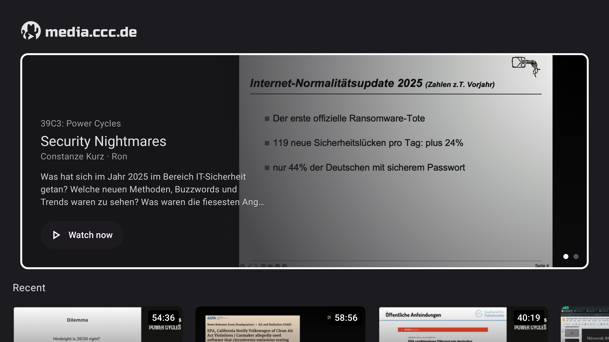
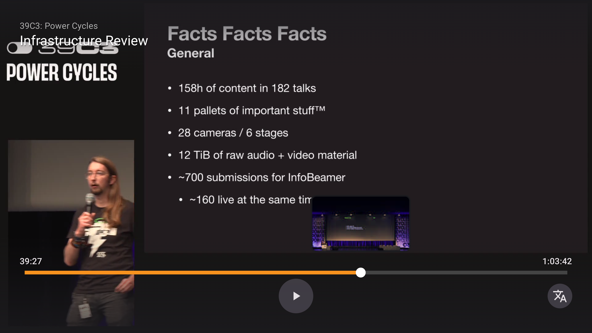
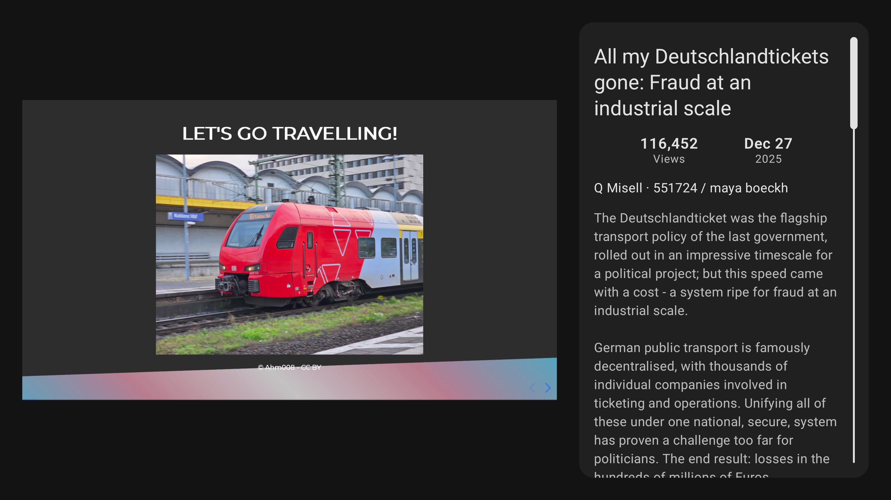
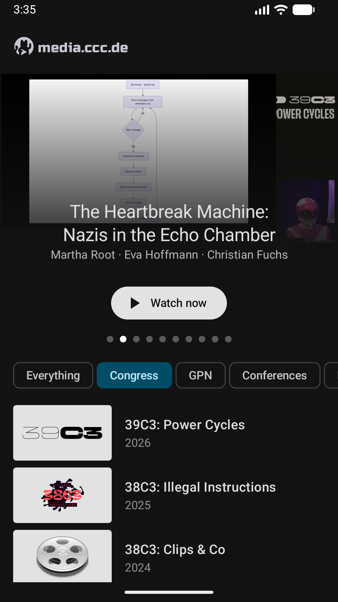
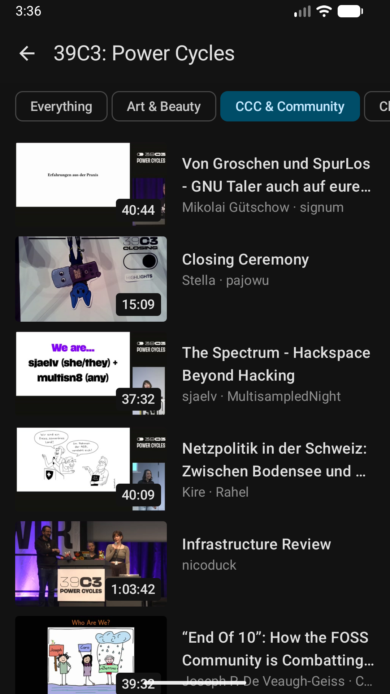
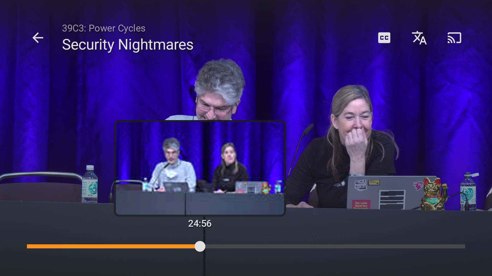

# VoctoTV

A stylish new AndroidTV client for media.ccc.de.

[Google Play](https://play.google.com/store/apps/details?id=de.justjanne.voctotv)
&nbsp;·&nbsp;
[APK](https://github.com/justjanne/voctotv/releases/latest/)

## Features

- Browse conferences, talks, documentaries and more.
- Choose audio language
- Seek through video with previews
- Subtitles (text/vtt and application/x-subrip)

## Roadmap

- Schedule integration (in the style of "Sendung verpasst?")
- Sort by popularity/genre

## Screenshots

### TV

### Smartphone

## License

[Voctocat](https://morr.cc/voctocat/) (c) [Blinry](https://github.com/blinry) under CC BY-NC-SA 4.0.

> This Source Code Form is subject to the terms of the Mozilla Public License, v. 2.0.
> If a copy of the MPL was not distributed with this file, You can obtain one at http://mozilla.org/MPL/2.0/.
